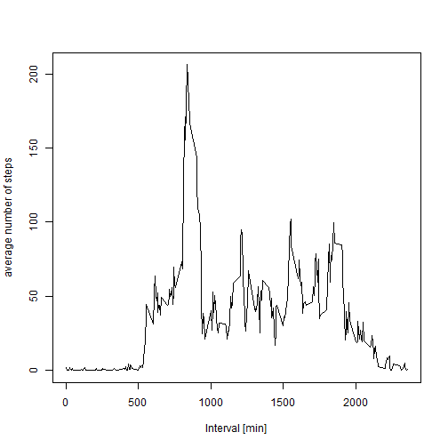
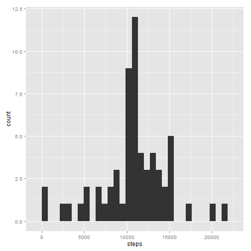
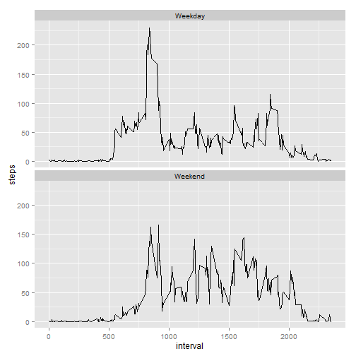
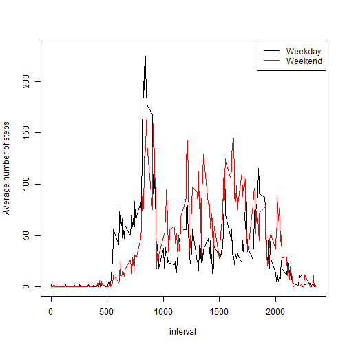

## Loading and preprocessing the data

As a first step, the provided csv file `activity.csv` is read into the memory. Output is suppressed, but the first lines as well as dimension and type of each column are 
subsequently displayed to check the correct import.


```r
inDat <- read.csv(file="activity.csv", header=TRUE, stringsAsFactors=FALSE)
dimDat <- dim(inDat)
```

The dimensions of the data table are (17568, 3). The following piece of
code shows the first lines of the data file and the class of each column.


```r
head(inDat)
```

```
##   steps       date interval
## 1    NA 2012-10-01        0
## 2    NA 2012-10-01        5
## 3    NA 2012-10-01       10
## 4    NA 2012-10-01       15
## 5    NA 2012-10-01       20
## 6    NA 2012-10-01       25
```

```r
sapply(inDat, class)
```

```
##       steps        date    interval 
##   "integer" "character"   "integer"
```

The `date` column is transformed into a Date data type and the correct transformation is checked again with the sapply funtion:


```r
inDat$date <- as.Date(inDat$date)
sapply(inDat, class)
```

```
##     steps      date  interval 
## "integer"    "Date" "integer"
```


## What is mean total number of steps taken per day?

In the following, the average number of steps per day is assessed. To this aim,
first the total number of steps is computed for each day within the data set.
The histogram across the averaged data is displayed.


```r
sumByDate <- aggregate(steps ~ date, inDat, sum)
#sumByDate
library(ggplot2)
qplot(steps, data=sumByDate)
```

 

```r
meanStep <- mean(sumByDate$steps)
medianStep <- median(sumByDate$steps)
```

Mean $\mu$ and median $M$ number of steps per day in the time interval between 
2012-10-02 and 2012-11-29 are given by
$\mu= 1.0766189 &times; 10<sup>4</sup>$ and $M= 10765$.


## What is the average daily activity pattern?

Next, the daily activity patter is of interest. Therefore, the step data is averaged across all days, per each 5-minute interval. Results are displayed in a standard line
plot.


```r
meanByMin <- aggregate(steps ~ interval, inDat, mean)
head(meanByMin)
```

```
##   interval     steps
## 1        0 1.7169811
## 2        5 0.3396226
## 3       10 0.1320755
## 4       15 0.1509434
## 5       20 0.0754717
## 6       25 2.0943396
```

```r
plot(steps ~ interval, data=meanByMin, type="l",
     xlab="Interval [min]", ylab="average number of steps")
```

 

```r
maxMean <- max(meanByMin$steps)
maxInt <- meanByMin$interval[meanByMin$steps==maxMean]
```

The maximum daily activity consists of an average of 206.17 steps taken in the interval between 835 and 840 minutes.


## Imputing missing values

In the following, the presence of missing values and their effect on some summary statistics is checked. At first, the missing time intervals are considered.


```r
naIndex <- which(is.na(inDat$interval))
length(naIndex)
```

```
## [1] 0
```

The length of the index vector is equal to 0 and thus
no missing interval exists. Next, we consider the missing steps.


```r
naIndex <- which(is.na(inDat$steps))
unique(inDat$date[naIndex])
```

```
## [1] "2012-10-01" "2012-10-08" "2012-11-01" "2012-11-04" "2012-11-09"
## [6] "2012-11-10" "2012-11-14" "2012-11-30"
```

```r
length(naIndex)
```

```
## [1] 2304
```

The number of only 8 different days on which missing values occur combined with the fact that the total number of missing values divided by the number of days equals exactly 
288, i.e. the total number of intervals per day, shows that step counts are either _not_ missing _at all_ or missing for a complete day. In the following, the missing steps on those days are replaced by the mean number of steps for each interval across all the other days.


```r
impuDat <- inDat
dim(meanByMin)
```

```
## [1] 288   2
```

```r
impuDat$steps[naIndex] <- meanByMin$steps
```

On the new data set with imputed data, the results from section 2 are recalculated
and the mean and median numbers are calculated.


```r
sumByDate2 <- aggregate(steps ~ date, impuDat, sum)
library(ggplot2)
qplot(steps, data=sumByDate2)
```

 

```r
meanStep2 <- mean(sumByDate2$steps)
medianStep2 <- median(sumByDate2$steps)
meanStep2
```

```
## [1] 10766.19
```

```r
medianStep2
```

```
## [1] 10766.19
```

The mean is not changed compared to the first analysis. This is not surprising since the missing days had all been imputed by the same data. Thus, the total
number of steps for those days is identical and equal to the average across
the total number of steps on all other days. The median, however, is now also
identical to the mean.

## Are there differences in activity patterns between weekdays and weekends?

In order to assess differences in the daily pattern between weekends and weekdays,
the imputed dataset is used to classify days as either weekend or working day. The
factor class is used to create a two-panel plot using the ggplot2 package. The
average across days does not need to be calculated explicitly since the summary
functionality of the qplot function is used.


```r
impuDat$wday <- weekdays(impuDat$date)
impuDat$class <- "Weekday"
# In my installation the weekdays() function returns the German names of the days. 
# The days "Samstag" and "Sonntag" are the English Saturday and Sunday.
impuDat$class[impuDat$wday %in% c("Samstag", "Sonntag")] <- "Weekend"
impuDat$class <- factor(impuDat$class)

# in the following, I use the summary functionality of the qplot function so that
# the average across all weekdays or weekends does not need to be calculated explicitly.
qplot(x=interval, y=steps, data=impuDat, stat="summary", fun.y = "mean", 
        geom=c("line") ) + facet_wrap(~class, nrow=2)
```

 


Alternatively, the means across days are explicitly calculated for each combination of time interval and class. The following plots displays the two curves in one overlay-plot using the base system with the weekend activity colored in red.


```r
meanByMinClass <- aggregate(steps ~ interval+class, impuDat, mean)
plot(steps~interval, data=subset(meanByMinClass, class=="Weekday"), type="l",
     ylab="Average number of steps")
lines(steps~interval, data=subset(meanByMinClass, class=="Weekend"), type="l",col=2)
legend(x="topright", col=c(1,2), legend=c("Weekday", "Weekend"), lty=1)
```

 

Both visualizations clearly show that the main activity on weekdays happens in the morning while on weekends the activity pattern is shifted towards later times.
